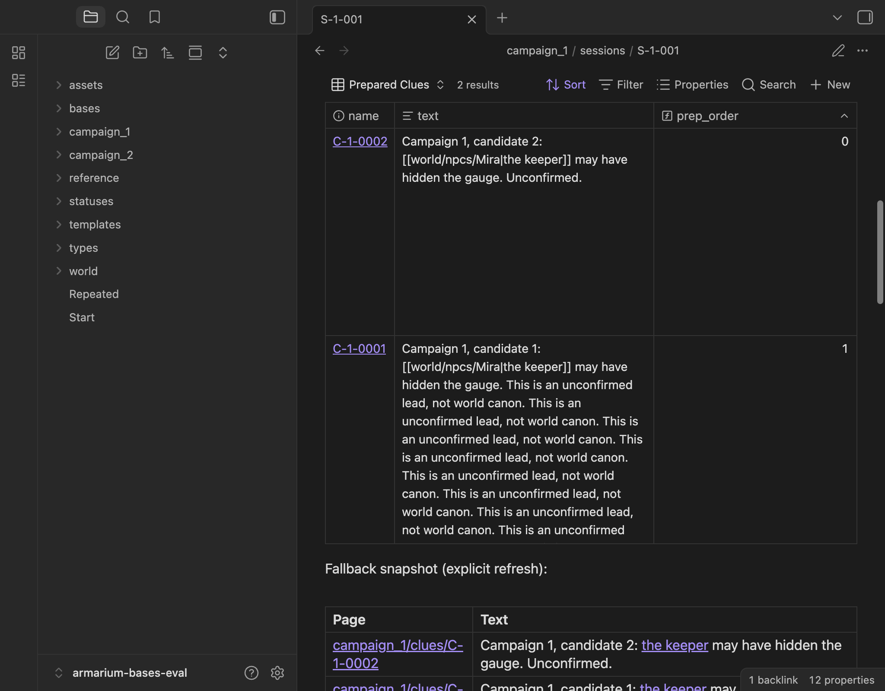
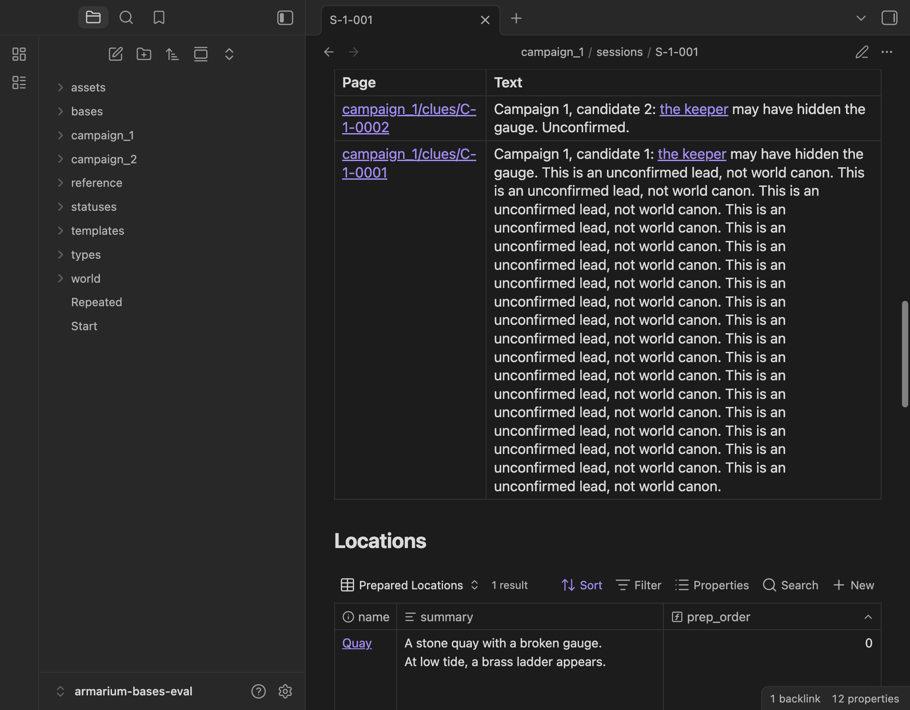

# Evaluation — 2026-09-21

Tested in the actual Obsidian desktop app, **1.13.7, installer 1.12.7**, on macOS
15.7.4. Core Bases ships with the app (no independent plugin version was reported).
Dataview was absent/disabled; no community plugins were enabled. Default dark
theme, 1024 × 800 logical viewport. Screenshots are the app's captured window.
The CLI initially reported itself disabled; subsequent calls succeeded. No
rendering result below relies on YAML validation or a simulated Bases engine.

## Recommendations

| Case | Observed result | Recommendation for #17 |
| --- | --- | --- |
| 1. Campaign Active/Closed indexes | Each campaign reports 2 active and 4 closed. Rows are campaign-specific and sorted by ID. | Use Bases as a live navigable index. Long `text` is a preview, not a rich reading surface; open the source record for full text. |
| 2. Entity Active Clues | Keeper Mira matches C-1-0001; visiting Mira matches C-1-0002. A misleading display alias cannot make the visiting Mira link match the keeper. Empty returns 0. Switching explicit context gives C-2-0001. All six status transitions behave correctly. | Use Bases selectively with explicit context. Do not infer campaign ownership for shared world pages. Empty sections and large-corpus latency make universal embedding questionable. |
| 3. Sessions on a Clue | C-1-0001 lists S-1-001, S-1-002, S-1-003 in that order (date, then number). The campaign 2 Events reference is excluded. C-2-0001 lists only S-2-001. | Use Bases. This compact navigation table was satisfactory. It includes deliberate prep and Events references, as required for Sessions; that rule is intentionally different from prep selection. |
| 4. Preparation text/summary tables | Explicit lists, intentional order, empty selections, source edits and selection edits work. Events-only NPC is excluded. Long text wraps but is constrained by the row/cell; embedded wikilinks remain literal text. A formula returning the same string also leaves them literal. | Bases fails the rich-text preparation criterion. Use the demonstrated bounded Markdown fallback when readable, linked narrative is required. Retain the Base artifacts for comparison; do not integrate both displays by default. |

For cases 1–2, clicking the Base's page link successfully opens the source Clue.
Their text-preview limitation is the same as case 4; they are recommended as
navigation indexes, not full narrative displays. If #17 requires fully rendered
narrative *inside* those indexes, that requirement remains unsatisfied by these
Bases views and needs a separately scoped fallback. No Dataview fallback was
installed or tested here.

## Evidence and exact exercises

Rebuild/open the fixtures and run the commands in [README.md](README.md). The
scripts are committed beside the inputs; JSON contains actual app DOM and results.

| Evidence | Exercise |
| --- | --- |
| [rendered.json](evidence/rendered.json) | `observe.py`: open each campaign index, both Miras, Empty, both campaigns' Clues, populated and empty Sessions in Reading view; scroll Base rows and record displayed values, link destinations and cell dimensions. |
| [edits.json](evidence/edits.json) | `exercise.py`: with entity view open, switch campaign context; redirect/restore subjects using qualified links with misleading aliases; cycle Hinted, Revealed, Abandoned, Dormant, Superseded, Pending. With prep open, edit source text and summary, remove all NPC selections, add/reorder them, carry selections to S-1-002. All 17 recorded checks passed; Events remained byte-for-byte unchanged. |
| [usability.json](evidence/usability.json) | `usability.py`: click the first NPC selection pill's remove button, observe one remaining prep row, click a Base page link, inspect long text and fallback links, click a fallback page link, edit source text, explicitly refresh the snapshot while the session is open. |
| [performance.json](evidence/performance.json) | `benchmark.py`: 3,353 Markdown files; 5 open trials each for a populated and an empty entity view, then scroll all 30 nested Active Clues embeds. |
| [deterministic-tests.txt](evidence/deterministic-tests.txt) | Python tests for fixture structure and statuses, fallback order/aliases/newlines, source refresh, idempotence, removal/carry-forward, Events preservation, conflicts, invalid selections, duplicate markers/selections and refusing an existing build destination. |
| [validator.txt](evidence/validator.txt) | Both complete generated vaults pass the structural validator from PR #19, pinned to `f30a60163185754ee1d823ca8fa3a0bd03456245`, under Python 3.14. |

The generated fixture has 12 synthetic Clues, 5 shared entities,
and 4 Sessions. NPC prep intentionally puts the visiting Mira before the keeper;
Clue prep intentionally puts 0002 before 0001. NPC Base labels use qualified paths
to distinguish the two Miras visually. The empty session still has an Events-only
NPC link and a Clue reference; all three prep Bases nevertheless remain empty.

### Readability and interaction



The committed Table setting is `rowHeight: extra`, verified in the running app
as eight times the 30 px base row height. A numeric `120` setting was ignored in
an early probe and was corrected before the final artifacts. Extra-tall rows
leave substantial whitespace for short text and do not solve arbitrary long text.
The text property control uses `pre-wrap` and `overflow: auto`; captured long cells
have content taller than their displayed area. They remain editable property
controls, not rendered Markdown. No custom CSS or plugin was used to hide this.



The fallback renders full long text, aliased links and multiline summaries.
It preserves list order and uses ordinary document scrolling. Base page-link
navigation reached `campaign_1/clues/C-1-0001.md`; fallback page-link navigation
reached `campaign_1/clues/C-1-0002.md`. The fallback's inline `the keeper` link
resolves to `world/npcs/Mira`, and its refreshed `the quay` link resolves to
`world/locations/Quay`. [Selection screenshot](evidence/selections.png) shows the
editable list widgets; clicking a remove button persisted the one-item list and
updated the Base.

### Refresh and history

No reload or reopen was necessary for the recorded text, summary, subjects,
statuses, campaign-context or selection-list edits. The harness allowed 700 ms
after metadata edits and additional DOM rendering time before observations; this
establishes eventual refresh, not a sub-700-ms latency guarantee. Changes used
Obsidian's `processFrontMatter` API, plus a real Properties-widget removal.
The explicit snapshot refresh wrote the Markdown file from Python; Obsidian
updated the visible fallback without reopening. Before that command, the snapshot
stayed unchanged even though the Base was live.

Reading view and Bases virtualize their DOM. Offscreen rows are not reliably
queryable until scrolled into view; the observer records rendered rows across
scroll positions. During exploratory probes, a temporarily blank/offscreen DOM
and a too-early widget query caused a failed probe; bringing the test window
forward, scrolling and waiting allowed capture. This was not classified as a
data-refresh failure. Two `ResizeObserver` warnings were observed during automated
scrolling. Cross-device sync, rename/move refresh and mobile rendering were not
tested; no claims about them are made.

Live Bases are **not historical snapshots**: changing a source page changes old
Sessions' displayed text too. The fallback becomes a deliberate snapshot only
when refresh is stopped. It fails automatic source refresh and in-table source
editing by design. Checksummed generated regions reject human edits rather than
overwrite them; human notes belong outside those regions. Add/remove/carry-forward
changes selection records and regenerated regions, never entity existence or Events.

## Performance and mostly empty sections

The larger fixture adds 3,000 NPCs and 300 Clues. Including the small fixture and
starter records, Obsidian reports **3,353 Markdown files**. The generated corpus is
deterministic and original. The timed run was in a desktop session with other
Obsidian windows open; this is an observed usability sample, not an isolated
microbenchmark or a supported capacity limit.

| Open-to-observed-readiness, 5 trials | Minimum | Median | Maximum |
| --- | ---: | ---: | ---: |
| Populated entity, 1 Clue | 121 ms | 126 ms | 176 ms |
| Empty entity | 60 ms | 62 ms | 67 ms |

The timer starts before opening the note; a 20-ms polling loop waits for the
expected result count and (for the populated view) a rendered row. Between trials
the harness opens Start and waits 50 ms, outside the timer. This measures warm
navigation/rendering, not vault indexing/startup, and cannot isolate query time
from app scheduling, layout and background-window effects. All ten trials reached
the expected result. An [earlier exploratory run](evidence/performance-initial.json),
before the metadata/ID cleanup, had populated-view timings of 123–936 ms and
empty-view timings of 56–3,730 ms, including 2.83- and 3.73-second empty trials.
Both runs used 3,353 files. Their different warm/cache/window conditions prevent
attributing the improvement to the fixture corrections. Keep the earlier outliers
visible rather than treating the final median as a performance guarantee.

Scrolling through 30 nested entity sections took **3.97 seconds**, including a
deliberate 100-ms wait for each section plus mounting/scroll polling. All 3 populated
and 27 empty result counts were correct. Nested Base context resolved to each
embedded entity. Empty embedded sections still occupied **193 px** each,
including headings, context text and the Base toolbar/header. This is visible
clutter even when query time is small. It does not prove 30 offscreen tables are
simultaneously mounted: the app virtualizes them. The earlier run took 11.96 seconds
and reported empty-section heights of 164–193 px while layout settled.

Reported JS heap changed from about 61.2 MB to 50.5 MB during the final sequence
(63.1 MB to 82.6 MB in the earlier run); without controlled garbage collection
these are not leak measurements. Prefer
on-demand/collapsed entity sections or compact campaign indexes during integration;
those alternatives were not themselves benchmarked in this prototype.

## Integration boundaries

No production templates, source campaigns, packaging or custom plugin changed.
The reusable `.base` artifacts and deterministic prep fallback are ready for
review, not an instruction to migrate every Dataview use. #17 should reconcile
the added campaign/context and selection properties with #13, run #6's validator
when available, and choose the intended live-versus-snapshot behavior explicitly.
The main baseline for this work was `5080ce0` (merged starter PR #12). While testing,
PR #19 became available for #6; its validator was run from a separate temporary
directory without merging that branch. Initial diagnostics caught omitted starter
properties, the campaign Reference type and synthetic Clue ID shape. The generator
now merges the starter's template defaults and uses C-1-1000 onward for corpus
Clues. It also keeps long YAML scalars on one physical line so a wikilink is not
split across lines. Both corrected fixtures pass. All acceptance evidence here
was recaptured against the corrected prototype, except the explicitly labeled
earlier performance sample retained for comparison.

To repeat that external validation without changing this checkout's branch:

```sh
git fetch origin pull/19/head
mkdir /tmp/armarium-validator-19
git archive f30a60163185754ee1d823ca8fa3a0bd03456245 scripts requirements.txt | tar -x -C /tmp/armarium-validator-19
python3.14 -m venv /tmp/armarium-validator-19/.venv
/tmp/armarium-validator-19/.venv/bin/pip install -r /tmp/armarium-validator-19/requirements.txt
/tmp/armarium-validator-19/.venv/bin/python /tmp/armarium-validator-19/scripts/validate_vault.py /tmp/armarium-bases-demo
/tmp/armarium-validator-19/.venv/bin/python /tmp/armarium-validator-19/scripts/validate_vault.py /tmp/armarium-bases-scale
```
